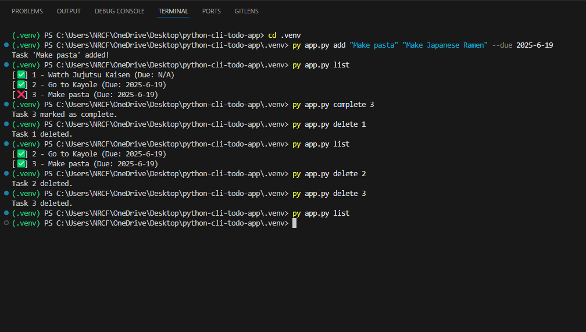

# Python CLI To-Do App

A simple command-line to-do list manager built in Python for tracking daily tasks.

## Features
- Add tasks with title, description, and due date
- List all tasks or filter by today's due date
- Mark tasks as complete
- Delete tasks
- Persistent JSON storage

## Usage

```bash
# Add a task
python app.py add "Buy milk" "2 packets" --due 2025-06-18

# List tasks
python app.py list

# List today’s tasks
python app.py list --today

# Mark a task complete
python app.py complete 1

# Delete a task
python app.py delete 1

```

## Screenshot of app in action


## How to Use the CLI Todo app

1. Clone the repo:
    git clone:  https://github.com/rayymaxx/python-cli-todo-app.git

2. Choose what to do to use the app eg. Add task, mark task as complete, list tasks or delete a task.